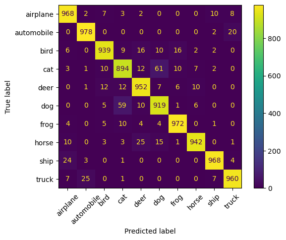
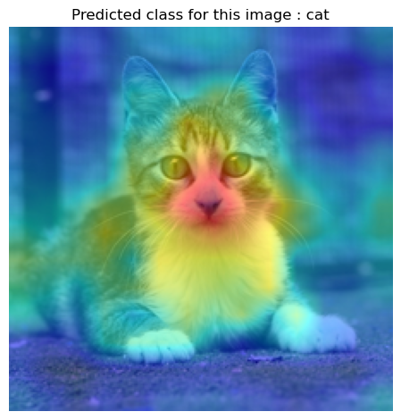
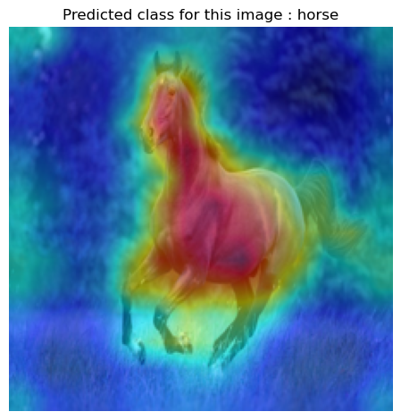
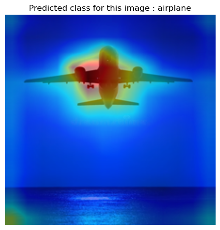
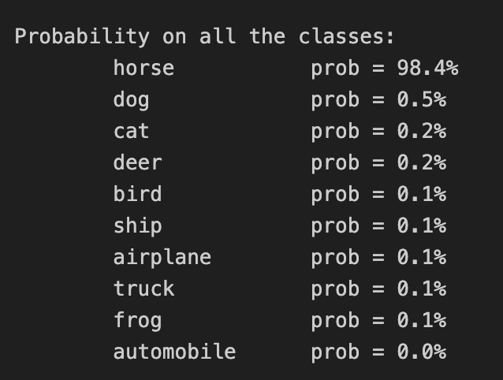

# 🧠 Explainable Vision Transformer for Image Classification

## Overview
This project fine-tunes a pre-trained Vision Transformer (ViT) for image classification and integrates Explainable AI (XAI) methods to visualize the model's focus areas during inference. This helps increase transparency and trust in the model’s decisions.

**Key features:**
* Fine-tuning of Facebook DeiT-Tiny ViT.
* Explainability techniques applied to interpret model predictions.
* Visualizations highlighting key features in input images.

## 🧠 Model

### Facebook DeiT-Tiny (Data-efficient Image Transformer)
- **Description:** Lightweight ViT optimized for data efficiency and accuracy.
- **Architecture:** 12 Transformer layers, 3 attention heads, 192 embedding size, ~3M parameters.
- **Input:** 224x224 pixels with 16x16 patches.
- **Features:** Trained with knowledge distillation; supports attention map extraction.
- **Pretrained on:** ImageNet-1k, then fine-tuned on CIFAR-10 and Food-101.
- **Source:** https://huggingface.co/facebook/deit-tiny-patch16-224

## 📂 Datasets
### CIFAR-10
- 10 classes of 32x32 natural images.
- 50,000 training / 10,000 test images.
- [Dataset details](https://www.cs.toronto.edu/~kriz/cifar.html)

## 📈 Performance on CIFAR-10
| Dataset  | Accuracy | F1 Score | Notes             |
|----------|----------|----------|-------------------|
| CIFAR-10 | 0.9492   | 0.9492   | Fine-tuned 3 epochs |

### Confusion Matrix

## 📊 Explainability Visualizations
<table>
  <tr>
    <td></td>
    <td></td>
    <td></td>
  </tr>
</table>

