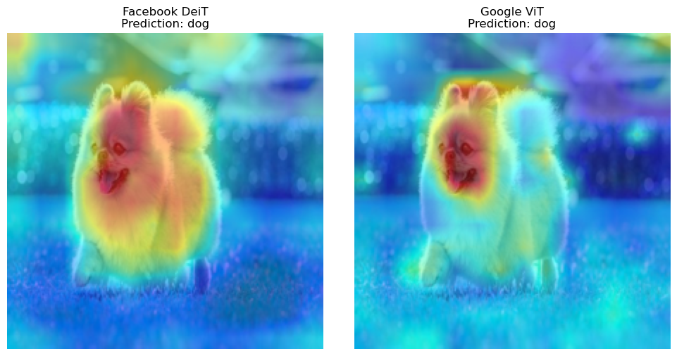

# 🧠 Explainable Vision Transformer for Image Classification

## Overview
This project fine-tunes a pre-trained Vision Transformer (ViT) for image classification and integrates Explainable AI (XAI) methods to visualize the model's focus areas during inference. This helps increase transparency and trust in the model’s decisions.

**Key features:**
* Fine-tuning of Facebook DeiT-Tiny ViT and Google-base ViT
* Explainability techniques applied to interpret model predictions.
* Visualizations highlighting key features in input images.

## 🧠 Models

### Facebook DeiT-Tiny (Data-efficient Image Transformer)
- **Description:** Lightweight ViT optimized for data efficiency and accuracy, actually more efficiently trained than ViT base.
- **Architecture:** 12 Transformer layers, 3 attention heads, 192 embedding size, ~5.5M parameters.
- **Input:** 224x224 pixels with 16x16 patches.
- **Pretrained on:** ImageNet-1k (1 million images, 1000 classes)
- **Source:** https://huggingface.co/facebook/deit-tiny-patch16-224

### Google Vision Transformer
- **Description:** The Vision Transformer (ViT) is a transformer encoder model (BERT-like) pretrained on a large collection of images in a supervised fashion, namely ImageNet-21k, at a resolution of 224x224 pixels.
- **Architecture:** 12 Transformer layers, 12 attention heads, 768 embedding size, ~86M parameters.
- **Input:** 224x224 pixels with 16x16 patches.
- **Pretrained on:** ImageNet-21k (14 million image, 21843 classes)
- **Source:** https://huggingface.co/google/vit-base-patch16-224

## 📂 Datasets

### ImageNet-1k (pre-training)
- 1000 classes of 224x224 images.
- 1,281,167 training / 50,000 validation / 100,000 test images.
- https://www.cs.toronto.edu/~kriz/cifar.html

### ImageNet-21k (pre-training)
- 1000 classes of 224x224 images.
- Split personalization
- https://arxiv.org/pdf/2104.10972

### CIFAR-10 (fine-tuning)
- 10 classes of 32x32 natural images.
- 50,000 training / 10,000 test images.
- https://www.cs.toronto.edu/~kriz/cifar.html

## 📈 Performance
| Model     | Accuracy | F1 Score | Loss | Notes | Hardware used
|-------------|----------|----------|-------------------|-------------------|-------------------|
| facebook DeiT | 0.9492   | 0.9492   | 0.1575 | Fine-tuned 3 epochs | Macbook Air M1 (16GB RAM)|
| Google ViT    | 0.9883   | 0.9883   | 0.0388 | Fine-tuned 3 epochs | Mac Studio M1 Ultra (64GB RAM)|

### Confusion Matrix
In order, the first confusion matrix corresponds to the test predictions of Facebook DeiT, while the second corresponds to those of Google ViT.
<table>
  <tr>
    <td></td>
    <td></td>
  </tr>
</table>

## 📊 Explainability Visualizations
<table>
  <tr>
    <td></td>
    <td></td>
    <td></td>
  </tr>
</table>

## Comparisons between models
<table>
  <tr>
    <td></td>
    <td></td>
  </tr>
  <tr>
    
  </tr>
  <tr>
    <td></td>
    <td></td>
  </tr>
</table>